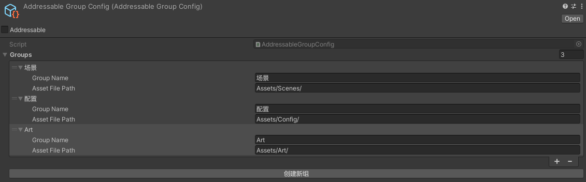
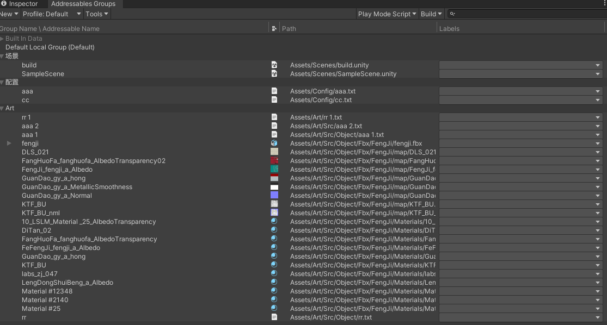

### Addressable批量分组管理

- 项目资源量较少时，可以手动把资源或者整个资源文件夹拖入Group中，然后修改address路径
- 如果资源量过大，分类太多，手拖效率过低，也容易出问题，所以可以编写代码批量管理

1. 添加可序列化类 生成.asset文件 用于配置分组名称 和 资源路径
```c#
[CreateAssetMenu(fileName = "AddressableGroupConfig", menuName = "New AddressableGroupConfig", order = 1)]
public class AddressableGroupConfig : ScriptableObject
{
    public List<GroupConfig> groups = new List<GroupConfig>();

   
}
[Serializable]
public struct GroupConfig {
    public string groupName;
    public string assetFilePath;
}

```
>

2. 获取序列化字段，设置组名，遍历文件夹下所有路径的文件添加到组

```c#

[CustomEditor(typeof(AddressableGroupConfig))]

public class AddressableEditor : Editor
{
    private SerializedProperty list;

    private static AddressableAssetSettings setting { get { return AddressableAssetSettingsDefaultObject.Settings; } }

    List<string> files = new List<string>();

    public override void OnInspectorGUI()
    {
        base.OnInspectorGUI();
        if (GUILayout.Button("创建新组"))
        {
            serializedObject.Update();
            list = serializedObject.FindProperty("groups");

            for (int i = 0; i < list.arraySize; i++)
            {
                var element = list.GetArrayElementAtIndex(i);
                var groupName = element.FindPropertyRelative("groupName");
                var assetFilePath = element.FindPropertyRelative("assetFilePath");
                var assetPath = assetFilePath.stringValue.Replace("\\", "/");
                assetPath.TrimEnd('/');

                files = new List<string>();

                GetForldInfo(assetPath, ref files);


                foreach (var file in files)
                {
                    DirectoryInfo folder = new DirectoryInfo(file);
                    if (folder.Extension == null || folder.Extension == ".meta") continue;


                    AddAssetEntry(CreateGroup(groupName.stringValue), file);

                }

            }

        }
    }
    /// <summary>
    /// 遍历文件夹
    /// </summary>
    /// <param name="filePath"></param>
    /// <param name="files"></param>
    private static void GetForldInfo(string filePath, ref List<string> files)
    {
        DirectoryInfo folder = new DirectoryInfo(filePath);
        foreach (FileSystemInfo file in folder.GetFileSystemInfos())
        {

            FileInfo fileInfo = file as FileInfo;
            if (fileInfo != null)
            {
                //获取文件所在原始路径
                string new_path = filePath + "\\" + fileInfo.Name;
                files.Add(new_path);
            }
            else
            {
                string pp = filePath + "\\" + file.Name;
                GetForldInfo(pp, ref files);
            }

        }
    }


    /// <summary>
    /// 创建分组
    /// </summary>
    /// <param name="groupName"></param>
    /// <param name="isSetAsDefaultGroup"></param>
    /// <returns></returns>
    private static AddressableAssetGroup CreateGroup(string groupName, bool isSetAsDefaultGroup = false)
    {

        AddressableAssetGroup group = setting.FindGroup(groupName);
        if (group != null)
        {
            return group;
        }
        group = setting.CreateGroup(groupName, isSetAsDefaultGroup, false, true, new List<AddressableAssetGroupSchema>());//创建Group

        setting.AddLabel(groupName, false);

        return group;

    }
    /// <summary>
    /// 添加资源到组
    /// </summary>
    /// <param name="group"></param>
    /// <param name="assetPath"></param>
    /// <returns></returns>
    private static AddressableAssetEntry AddAssetEntry(AddressableAssetGroup group, string assetPath)
    {
        string guid = AssetDatabase.AssetPathToGUID(assetPath);

        AddressableAssetEntry entry = setting.CreateOrMoveEntry(guid, group, false, true);
        if (entry == null)
        {
            return entry;

        }
        entry.address = Path.GetFileNameWithoutExtension(assetPath);
        //entry.SetLabel(group.Name, true, false, true);//创建标签  
        return entry;
    }

}


```
>